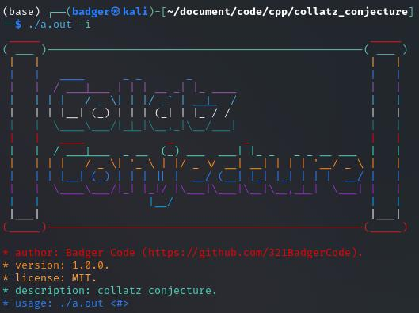

# Collatz Conjecture Program

This C++ program applies the Collatz Conjecture to a given number or a randomly generated number and calculates the number of iterations until reaching 1.

```diff
- This program cannot work with super large #'s (largest input # is (2^64)-1).
	- This is due to the fact that the program uses an unsigned long long data type which stores 64 bits.
- TODO: implement a table for displaying the rows rather than using tabular indents.
```
## Preview

> Information about the program.  


> This depicts a property of the Collatz Conjecture which is that if a number is multiplied by 2, then it will take 1 more iteration to reach 1.  


> This shows how you can use numbers in exponential form such as `2^10` as input.  
.jpg)

## Getting Started

### Prerequisites

> Must have Git installed to clone the repository.
```sh
git clone https://github.com/321BadgerCode/collatz_conjecture.git
cd ./collatz_conjecture/
```

### Compile

> Must have MinGW installed to compile with `g++`.
```sh
g++ ./main.cpp
```

### Usage

* Linux: `./a.out`
* Windows: `a.exe`

> Linux
```sh
chmod +x ./a.out
./a.out
```

---

> Windows
```sh
attrib +x ./a.exe
./a.exe
```

**Running Executable**:
- If providing a specific number:
	```sh
	./a.out <number>
	```
	- Numbers can be inputted in exponential form such as `2^10`.
- If no number provided (uses a random number between 1 and 100):
	```sh
	./a.out
	```
> Replace `<number>` with the desired starting number.  
Number must be a natural number (0<#<∞).

<details>

<summary>Command Line Arguments</summary>

**Usage:** `./a.out <#>`

| Argument | Description |
| --- | --- |
| `-h` | help |
| `-a` | about |
| `-i` | info |
| `-c` | context |
| `-s <filename="./data.json">` | save data to json file |

> NOTE: If using a parameter that uses an argument such as `-s`, then the argument must come after `<#>` like:
```sh
./a.out 1 -s
```

</details>

## History

The Collatz conjecture, also known as the 3n+1 problem, is one of the most famous unsolved problems in mathematics. It was first proposed by Lothar Collatz in 1937, although it had been independently discovered by others earlier. The conjecture is very simple to state, but it has proven to be extremely difficult to prove.

**Brief Summary**

The Collatz conjecture states that if you take any positive integer and repeatedly apply the following rules, you will eventually reach the number 1:

* If the number is even, divide it by 2.
* If the number is odd, multiply it by 3 and add 1.

For example, if you start with the number 7, you would get the following sequence: 7, 22, 11, 34, 17, 52, 26, 13, 40, 20, 10, 5, 16, 8, 4, 2, 1.

**History**

The Collatz conjecture was first proposed by Lothar Collatz in 1937 in a talk at the University of Marburg. However, it had been independently discovered by others earlier. For example, the mathematician Mario Luciani had proposed a similar conjecture in 1950.

The conjecture has been extensively studied by mathematicians. For example, the conjecture has been verified for all positive integers up to at least 2^68.

In 1985, the mathematician Jeffrey Lagarias offered a $1,000 prize for a proof of the Collatz conjecture. However, the prize has not yet been awarded.

## Contributing

Contributions are welcome! Feel free to fork the repository and submit pull requests.

## License

This project is licensed under the MIT License - see the [LICENSE](LICENSE) file for details.